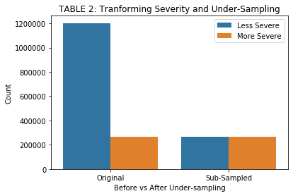
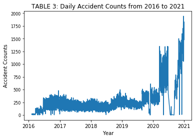
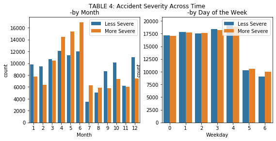
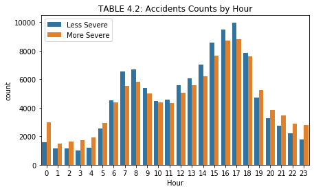
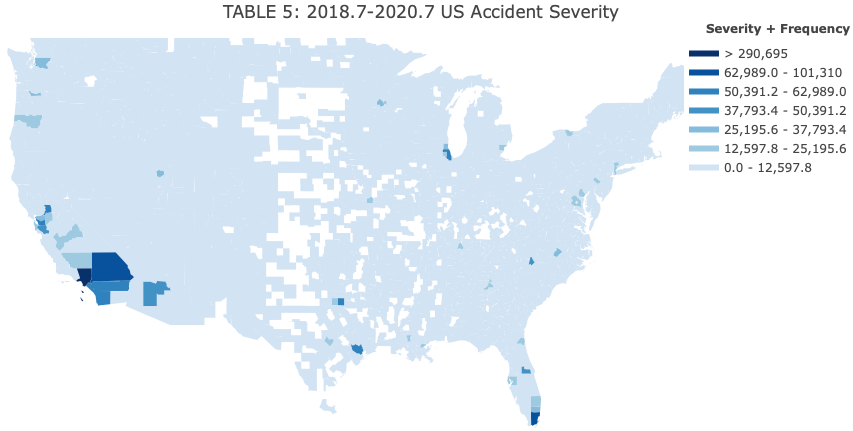
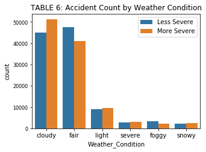

# Midterm Report 
#### Muyuan Liu (ml2699), Duanduan Zhu (dz223) | ORIE 4741 | 2021.11.01

 
##  1. Introduction 

While car accidents cause safety issues for citizens, this project aims to focus on the economic impacts; in other words, we want to ***predict accidents’ impact on the traffic***. Our data set consists of ***47 features and 1,516,064 data records***. Each record represents a car accident in the US during 2016 to 2020. The variable of interest is ‘accident severity’ (on the traffic), which has been previously encoded from 1 to 4 with 4 being the most severe. The independent variables mainly contain ***4 aspects***, including locations, timings, weathers, and traffic conditions. They also have ***3 major data types***: continuous values (int/float), categorical(object/bool), text (object) shown in TABLE 1.

Table 1 shows all features with missing values and percentage of missing. 19 out of 47 features contain missing values and the majority is missing less than 10%. We divided these features into 4 types and treated them differently. ***First***, the top 3 features are missing far too many values, 60% and 30% (compared to less than 10% missing in other features). Imputation would be less accurate and affect data integrity, so we decided to drop them. ***Second***, the last 8 features only miss less than 5000 entries (<0.5%), so we simply dropped the missing rows. ***Third***, the rest of the features are missing about 1% each and are all weather features. We will impute them with data in the same county during the same 2-week period. ***Categorical*** features such as ‘weather_condition’ will be imputed by the most common category in that period and ***real-value*** features will be imputed by the median of the period. 

## 2. Cleaning, Exploring, and Engineering the Features 

We cleaned data format in each feature and conducted exploratory analysis to find insights. Based on the insights, we further cleaned outliers, transformed data into new features, or engineered additional encoding. In the end, we dropped features we believed were meaningless or unable to include in the model. Below, we will introduce a few features that required substantial engineering and yielded significant insights. 

**Severity (Dependent Variable):** has four values from 1 to 4. The challenge is that there is ***no knowledge of how the levels are defined*** and only 1% of total data has a severity level of 1. Therefore, we transformed severity into a ***binary categorical feature*** by combining level 1 and 2 into ‘less severe’ and 3 and 4 into ‘more severe’. However, from TABLE 2, there was still a serious ***imbalance*** between the two classes, so we performed a ***random under-sampling*** on the majority class (‘less severe’), retaining a balanced data set where the two labels weigh equally. 

**Time:** After ***converting the feature into ‘datetime’*** format, we plotted the number of accidents in the past 4 years. From TABLE 3, we observed an unexpected dip of records during July 2020, a sharp increase and great volatility thereafter. To retain stable, sufficient and recent data, we decided to ***keep data only from 2018-07-01 to 2020-07-01***. Second, even though we observed cyclicality in the data, accidents are not naturally determined by date and people are more interested in learning causes due to weather and location. Therefore, this is ***not a time series prediction*** and we will only incorporate date information in terms of the year, month, week, day of the week, and time of the day (by creating these new features). 

From TABLE 4 we observed that compared to other seasons, ***winter has more accidents but less severe ones***, possibly because there is more precipitation then, but people are more cautious. Moreover, there are ***more accidents on weekdays***, but weekends tend to have more severe cases. Similarly, there are ***more accidents during rush hours*** but more severe ones at night. Last, we removed some Boolean features which produced almost identical insights. 

 **County:** includes 1671 unique counties in the US. We first ***join our dataset with an external county indices*** table and observed accident severity and frequencies in the following map (TABLE 5). We can clearly notice that accident distributions are ***extremely skewed to the right***.  Even among the top 3 counties, Los Angeles County has 3 times more accidents than Miami County and 5 times than San Bernardino, which is only a 30-minute drive away from LA. Counties in Texas and Illinois have the highest severity. The rest all have equally low frequency or severity. Therefore, we created 5 buckets based on the frequency of the more severe accidents and ***encoded the counties using 5 buckets***. As a result, each record will belong to a county_severity_level from 1 to 5.

**Weather:** One major weather indicator is ‘weather_condition’, a categorical feature with 117 labels. We first applied ***text manipulation*** to sort the labels into 6 groups (in TABLE 6). Accidents in general are more likely to happen in cloudy days and moderate weathers, maybe because that less people are inclined to go out during severe weathers. ***Weathers with precipitation (cloudy, light rain, severe storms, snowy) have more severe cases.*** Since all six categories showed variation and reasonable insights, we ***kept them all***. We did a similar text manipulation with ‘wind_direction’ and removed features that produced not workable insights.  

**Street Locations:** contain 93,048 unique values of actual street names. We extracted 20 most frequent ones (e.g., US-, Interstate-) through text manipulation, created a dummy variable for each, and compared the correlation of the labels with accident severity. Although we did not gain significant insights on the current sub-sampled data set, we plan to apply this approach on future samples and modifications. 

## 3. Fitting and Interpreting Models

We ***first applied 3 methods*** to improve model fit. We implemented ***one-hot encoding*** to convert categorical features into binary ones, obtaining 27 features. We then ***scaled and standardized*** the data. And last, we split the data into ***training and testing data*** set by an 8-2 ratio. 

In fitting a logistic regression model, we used a grid search to find the best hyperparameters and regularization method. The best model used L2 regularization and had an ***overall accuracy of 0.72***. From TABLE 7, we see that training and testing errors are similar, and that the error metrics give similar results, suggesting that we managed to ***avoid overfitting.*** However, we think the accuracy is not high enough for us to gain insights from this model (e.g., interpreting p-values). We aim to ***further improve model performances*** in the next steps. 

## 4. Key Considerations

***In order to prevent overfitting and underfitting***, we retained sufficient data points (220000) and obtained only 27 relevant features. We removed missing values to prevent sparsity, and reduced categories in some features to decrease total features in the model. We also plan to use ensemble learning methods to prevent underfitting. Additionally, ***to test model effectiveness (and prevent overfitting)***, we split the data into training and testing set, and plan to apply cross validation. Regularization is also used in logistic regression model that we fit. Last, ***to choose the best features to use***, we first examined the variation and insight in each feature, and selected the features that are sufficiently correlated with ‘severity’ from a correlation heatmap.  

## 5. Next Steps

We first plan to ***fit more models*** using the current sample data set, especially boosting and bagging methods, which and prevent over- or under-fitting and produce feature importance rankings. Then, we will ***further engineer features and resample the data***. If necessary, we may try to encode more complicated features that we removed currently. After achieving a target error rate, we will ***adjust classification threshold or error metrics*** for sensitivity analysis. Last, we expect to ***apply the model*** on states like CA, TX, and FL where cases are the most frequent and severe, in order to ***answer what exactly are the causes and how to predict them. ***
